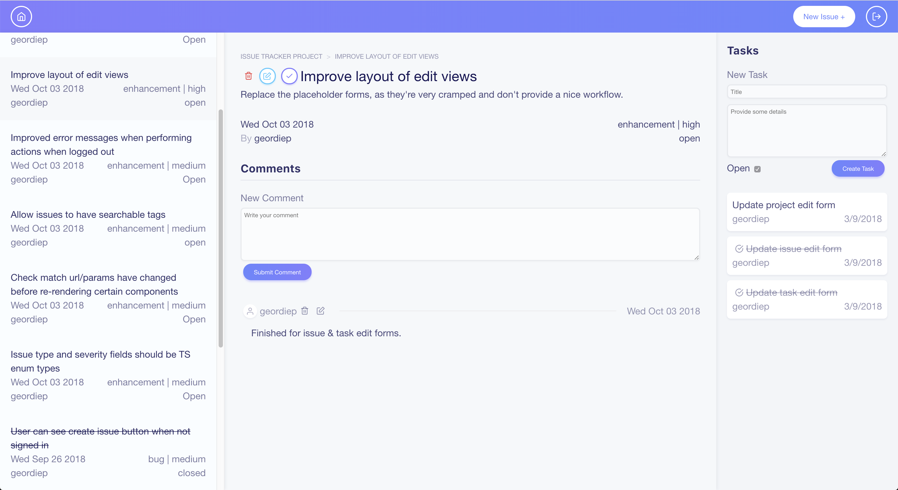
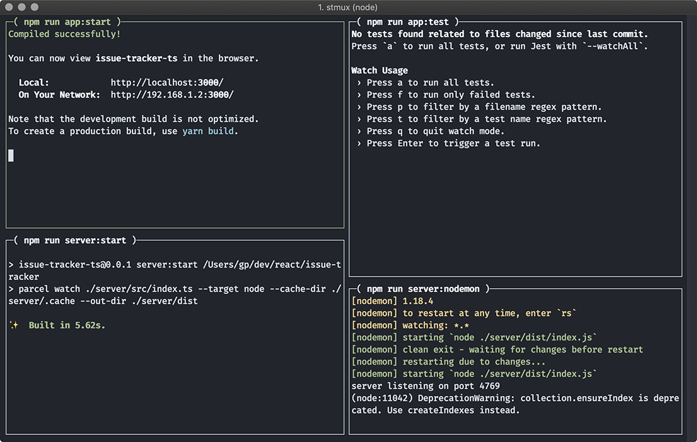

# issue tracker

Inspired by Jira, GitHub Issues, Redmine, Mantis, and similar applications, this is an experiment into creating my own alternative, while also exploring a number of technologies I haven't yet tried out (most notably TypeScript, Koa, and GraphQL).

##### This project is **NOT** production ready! It's still very much in the proof of concept / experimentation phase.

## Libraries
#### Frontend
- [TypeScript](https://www.typescriptlang.org/)
- [React](https://reactjs.org/)
- [create-react-app](https://github.com/facebook/create-react-app)
- [react-app-rewired](https://github.com/timarney/react-app-rewired)
- [react-router](https://github.com/ReactTraining/react-router)
- [Apollo GraphQL Client](https://www.apollographql.com/)
- [apollo-link-state](https://www.apollographql.com/)
- [PostCSS](https://github.com/postcss/postcss)
- [react-testing-library](https://github.com/kentcdodds/react-testing-library)

#### Backend
- [TypeScript](https://www.typescriptlang.org/)
- [Koa](https://koajs.com/)
- [Passport.js](http://www.passportjs.org/)
- [GraphQL](https://graphql.org/)
- [Redis](https://redis.io/)
- [MongoDB](https://www.mongodb.com/)
- [bcryptjs](https://www.npmjs.com/package/bcryptjs)
- [Parcel](https://parceljs.org/)

### Testing & other tools
- [Jest](https://jestjs.io/) (Unit tests)
- [Cypress](https://www.cypress.io/) (Integration & E2E Tests)
- [stmux](https://github.com/rse/stmux) (Display the output from several node commands in one window)

## Development Setup

### Prerequisites

##### Dev Database

At this stage of development, the application relies on a MongoDB database to be running on port 27017, accessible with the credentials `admin:admin`, as well as a Redis instance on its default port of 6379. While any running MongoDB instance will work, a simple solution using Docker is included in the project (docker is required, and docker-compose is suggested).

Under the directory `server/` you'll find a `docker-compose.yml` file to start Docker containers for these required tools automatically, with the database peristing to a local path of `server/db/`. Also included is mongo express, allowing basic control over the database through an interface served on http://localhost:8081.

The compose file can be used manually, or by using the provided bash scripts - from the `server/` directory, you can run `./start-db` and `./stop-db` to start and stop respectively. Of course, you can alternatively start the docker containers manually through the command line.

##### Keys file for `koa-session`

`koa-session` relies on a keys file, located at `server/src/keys.json`. The file should contain an array of key strings (at least 1). This file is excluded from the git index, so you'll have to create your own.

A Python script is provided to automatically generate a basic keys file for you - From the `server/src/` directory, simply run `python gen-keys.py`

### Running in dev mode

Run `yarn start` or `npm start` to run the app in dev mode. This will run several commands through stmux and give you a "dashboard" view of the following processes;

- [Top left] create-react-app in dev mode serving the app frontend on http://localhost:3000 (requests inside the app are proxied along to localhost:4769)
- [Top right] Jest running unit tests in watch mode
- [Bottom left] Parcel build on backend Koa server
- [Bottom right] Nodemon instance to auto-restart the server on compilation (server runs on port 4769)

## Testing

Unit tests are automatically run during dev mode, but can also be executed using the command `yarn app:test` (or `npm run app:test`).

End to end tests are handled by [Cypress](https://www.cypress.io/). Run the command `yarn stmux:test` to start the issue tracker server, serve the app frontend, and open the Cypress UI. Run the entire e2e test suite by clicking the "Run all specs".

## Project Structure

### Frontend (`src/`)

`index.tsx` does some initial setup of Apollo (notably `apollo-link-state`), sends some initial server requests, and renders `LayoutRoutes.tsx` inside all necessary app-level providers.

`LayoutRoutes.tsx` is stateless, and simply routes all necessary top-level routes to the appropriate **Layout** components.

#### Layouts
Layouts are stateless components that define different ways of organizing the various pieces (or "slots") of the page, and render them with the styles necessary to place them where they belong. Currently there are two layouts; one standard "page" layout, and one "split" layout where a sidebar is rendered next to the content area.

Common slots like the site navigation bar or main content area might be placed or rendered differently between certain layouts. Some elements, such as a sidebar, may only exist in some layouts and completely ignored in others. Layouts render divs representing the slots that make up the page, each one containing react-router routes that decide which components should be rendered.

#### Views

Views are what (usually) get rendered into layout slots. They are stateless, and present all the components relevant to a certain piece of the page (eg. Login view, project list view, project details view, issue details view, etc), and wrap these components in the necessary Apollo queries/mutations.

#### Containers

Containers are re-usable bits of the interface that do something "extra"; they might be stateful, or interact with Apollo queries and mutations.

#### Components

Standard stateless components that simply render markup. Most (though not all) components accept CSS-related props and pass them down to their root element, allowing parents to properly style their children. Some components have their own styles, independent from the rest of the site's control.

### Backend (`server/`)

`server/index.ts` sets up a Koa server that serves REST endpoints for authentication (`auth/register`, `auth/login`, `auth/logout`, `auth/status`), and a `/graphql` endpoint for GraphQL requests. A GET to `/graphql` will serve the GraphiQL IDE interface for playing around with the server's GQL API.

Currently data is stored using MongoDB (via mongoose), but the plan is to switch to PostgreSQL at some point. User authentication is handled by Passport, bcrypt is used on passwords, and user session management is handled using redis via koa-session.

### Tests

Unit tests live inside Component directories along with their implementation files, usually named either `test.tsx` or `ComponentName.test.tsx`. These get picked up by Jest and executed.

[Cypress](https://www.cypress.io/) is used for integration and end-to-end tests. Integration tests live in `cypress/integration/`, and E2E tests live in a sub-directory, `cypress/integration/e2e`. Cypress picks up test files in these locations and allows them to be run from the Cypress UI.
